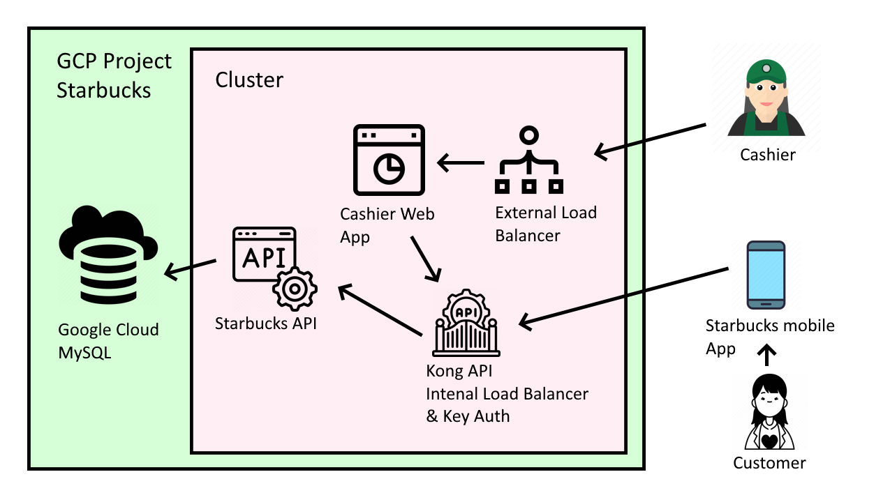

# CMPE 172 Starbucks Project

This is the end-to-end project for Capstone Experience Program at the San Jose State University, Summer 2022. 

## This a multi-tear end-to-end project that consists of the following components:

* A web application that allows cashiers to manage their customers' orders (Cashier's app)
* A mobile application that allows customers to pay for their orders (Starbucks app)
* A Starbucks API that handles the requests from the Cashier's app and the Starbucks app
* A database that stores the information of the orders and cards

## Architecture

While the Starbucks mobile app is in the user's phone, Cashier's app is deployed to the Google Cloud, where it is scaled by a proxy server. The Starbucks API itself is also deployed to the Google Cloud as a separate deployment unit, wrapped and secured with Kong API Gateway proxy. Only this API has the access to the starbucks database, which is also on the Google Cloud. Both Cashier's app and Starbucks API are Spring Boot applications, while the Starbucks mobile app is a Java based application.

Here is the architecture diagram of this project:

The Cashier app and especially Starbucks API are scalable, have multiple pods. They can handle million user requests, and load balancer helps to distribute the requests to the pods (external load balancer for the cashiers and Kong's internal load balancer for all requests that go to Starbucks API). However, there is a limitation to the number of active orders. There can only be one active order for one register at the time, and if a request for placing a new order into register is sent, it will be rejected and will not be processed, and it does not depend on the pods, since all API pods get data only from the database and do NOT have static data (I removed the activeOrders hashmap and udpated the code).

This can be improved further if RabbitMQ is added to the play. For instance, we could send place order requests to the RabbitMQ queue first, and orders will be there on hold, awaiting for their turn. Then, the API will get the next order from the queue for the registry and make it active, until there are no more orders in the queue. Unfortunately, due to time constraints, I had no time to implement RabbitMQ.
